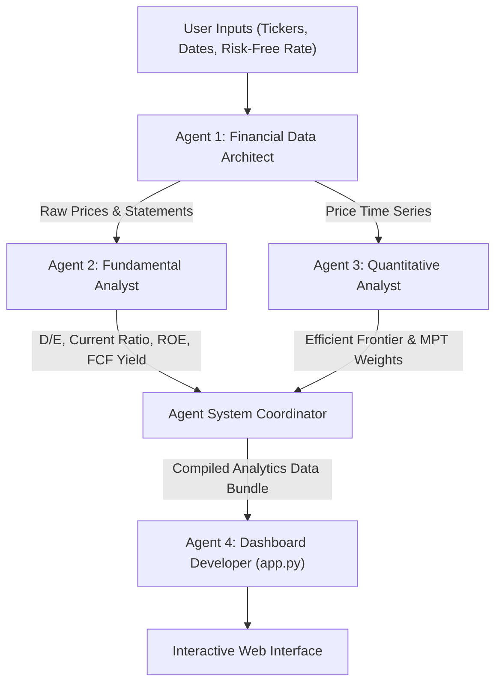

# Financial Statement & Portfolio Analytics Engine

An interactive, multi-agent Financial Statement & Portfolio Optimization Dashboard built with Python, Streamlit, Plotly, and Modern Portfolio Theory (MPT).

## 🌟 Overview

The **Financial Statement & Portfolio Analytics Engine** coordinates specialized AI agents to ingest financial statements, evaluate fundamental corporate health metrics, execute MPT portfolio optimizations, and display interactive visual analytics.

---

## 🤖 Multi-Agent Architecture



### Agent Roles

1. **Agent 1: Financial Data Architect (`src/agents/data_architect.py`)**
   - Fetches 5-year historical daily price data and financial statements (Income Statement, Balance Sheet, Cash Flow) via `yfinance`.
   - Cleans missing values, aligns reporting dates, and standardizes data schema.

2. **Agent 2: Fundamental Analyst (`src/agents/fundamental_analyst.py`)**
   - Extracts key corporate health metrics: **Debt-to-Equity**, **Current Ratio**, **Return on Equity (ROE)**, and **Free Cash Flow Yield**.
   - Generates automated health alerts and financial flags.

3. **Agent 3: Quantitative Analyst (`src/agents/quant_analyst.py`)**
   - Calculates CAGR, annualized return, volatility, max drawdown, and cross-asset return correlation matrices.
   - Solves MPT optimizations using `scipy.optimize`:
     - **Max Sharpe Ratio Portfolio**
     - **Minimum Variance Portfolio**
     - **Efficient Frontier Curve** & Monte Carlo portfolio simulation.

4. **Agent 4: Full-Stack Dashboard Developer (`app.py`)**
   - Renders a multi-tab Streamlit dashboard with Plotly visual analytics, financial statement inspector, and custom portfolio rebalancing simulator.

---

## 🚀 Quick Start

### Prerequisites
- Python 3.10+
- `pip`

### Installation

1. **Clone the repository:**
   ```bash
   git clone https://github.com/manandewan/Financial-Statement-Portfolio-Analytics-Engine.git
   cd Financial-Statement-Portfolio-Analytics-Engine
   ```

2. **Set up virtual environment & install dependencies:**
   ```bash
   python3 -m venv .venv
   source .venv/bin/activate
   pip install -r requirements.txt
   ```

3. **Launch the Dashboard:**
   ```bash
   PYTHONPATH=. streamlit run app.py
   ```
   Open `http://localhost:8501` in your browser.

---

## 🧪 Running Tests

To run the automated test suite:
```bash
source .venv/bin/activate
PYTHONPATH=. python -m unittest discover -s tests
```

---

## 📁 Repository Structure

```
├── app.py                      # Agent 4: Streamlit Dashboard Application
├── src/
│   ├── agents/
│   │   ├── data_architect.py    # Agent 1: Data Ingestion & Cleaning
│   │   ├── fundamental_analyst.py # Agent 2: Fundamental Ratios
│   │   ├── quant_analyst.py    # Agent 3: MPT Portfolio Optimizer
│   │   └── coordinator.py      # Master Agent Orchestrator
├── tests/
│   ├── test_agents.py          # Unit Test Suite
│   └── test_live_pipeline.py   # Live Pipeline Integration Test
├── requirements.txt            # Project Dependencies
├── README.md                   # System Documentation
└── .gitignore
```
